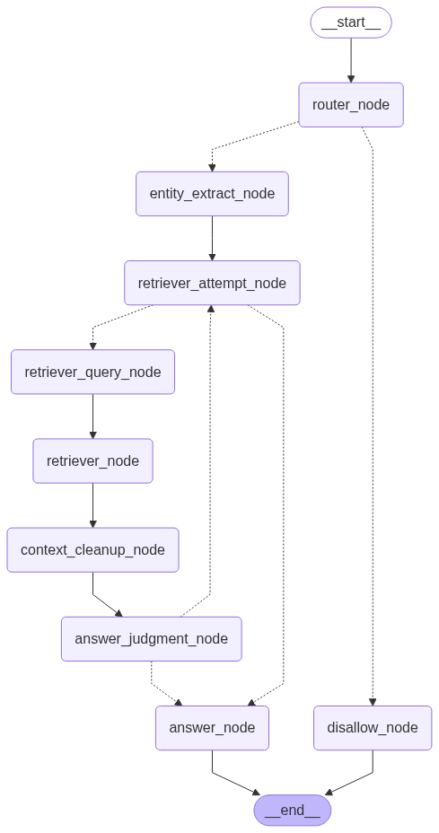

# StarCraft 2 Editor AI

This project is an **LLM-powered assistant for the StarCraft 2 Editor**, built using [Google Gemini](https://ai.google.dev).

---

## 🧠 Overview

* **Tech Stack**:
  * **Package/Project Management**: uv
  * **Linting/Formatting**: Ruff
  * **Configuration**: PyYAML, Pydantic Settings
  * **Dependency Injection**: Dependency Injector
  * **Security**: bcrypt, PyJWT
  * **Backend**: FastAPI, Uvicorn, SlowApi
  * **LLM**: LangChain, LangGraph
  * **Graph Database**: Neo4j AuraDB

---

## 🧰 Requirements

* **Python**: 3.12 or higher
  It is recommended to use `uv` for package and project management.
* **Google Gemini API Access**
* **Neo4j AuraDB Instance**

Refer to each service's official documentation for installation and setup instructions.

---

## ⚙️ Environment Configuration

Create a `.env` file in the **root directory** with the following structure:

```env
GOOGLE_API_KEY=

NEO4J_URI=
NEO4J_USERNAME=
NEO4J_PASSWORD=
AURA_INSTANCEID=
AURA_INSTANCENAME=

ADMIN_USERNAME=
ADMIN_PASSWORD=

JWT_SECRET_KEY=
ALGORITHM=

UVICORN_HOST=
UVICORN_PORT=

# Optional
LANGSMITH_TRACING=
LANGSMITH_ENDPOINT=
LANGSMITH_PROJECT=
LANGCHAIN_API_KEY=
```

---

## 🏗️ Database Initialization

1. Create a Neo4j AuraDB instance.
2. Ensure your `.env` file contains the correct Neo4j credentials.
3. Run the following scripts from the `database/` directory to build the graph database:

```bash
python -m database/graph_database.py
python -m database/embedding_property.py
```

---

## 🧹 LLM Architecture

A detailed graph of a **single-agent architecture** using LangGraph is shown in the image below.



---

## 🚀 How to Run

From the root directory:

```bash
python main.py
```

The locations of the data used in this project are as follows. When adding data later, you can use the same locations.
At this time, the extension must be .md, which is a Markdown extension.

```
sc2editor/datas/new_tutorials/
```

---

## 📚 Data Sources

The sources of data used in this project are as follows:

🔗 [StarCraft 2 Editor Guides](https://s2editor-guides.readthedocs.io/)

---